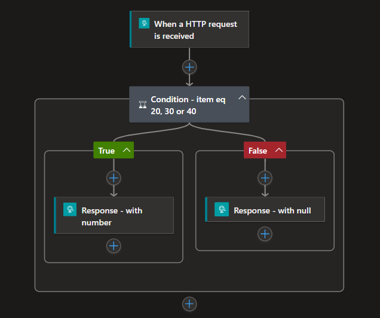
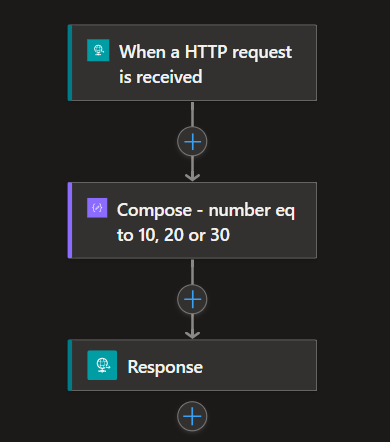
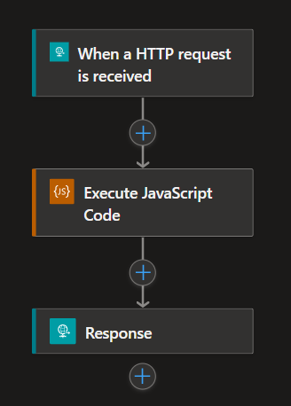
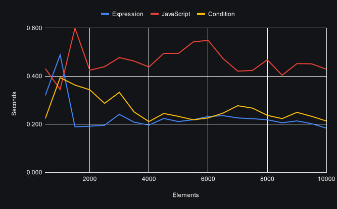
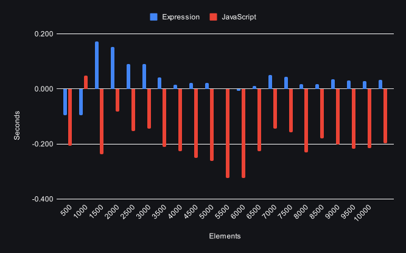

## Background   
Logic Apps is a flexible service that provides you with the tools to implement tasks in various ways. Having more options is often beneficial, but sometimes it can be a bit confusing. How do you determine when to use which method and under what circumstances? Is there a method that is faster or slower?

In this post, we will explore three different methods to implement if statements in Logic Apps Standard. We will conduct benchmarks and compare the results.

##  Exploring Alternatives to If statements 🏴󠁲󠁯󠁩󠁦󠁿
As you start developing, you will encounter if statements quite quickly; they serve as control mechanisms to decide actions based on values. In Logic Apps, the <a href="https://learn.microsoft.com/en-us/azure/logic-apps/logic-apps-control-flow-conditional-statement?tabs=consumption" target="_blank" rel="noopener noreferrer">Condition action</a> is the counterpart of if statements, but there are alternative actions and functions that you could use, such as the <a href="https://learn.microsoft.com/en-us/azure/logic-apps/logic-apps-add-run-inline-code?tabs=consumption" target="_blank" rel="noopener noreferrer">Inline code action</a> and <a href="https://learn.microsoft.com/en-us/azure/logic-apps/workflow-definition-language-functions-reference" target="_blank" rel="noopener noreferrer">Expression</a>. Each of these methods comes with its perks and limitations!

### Condition action
Works similarly to an if-else statement. The action will return either true or false, executing one of the paths. The action supports your classic logical operations such as:

- `or`, only one of the statements has to be `true` for the action to return true.
- `and`, all of your statements have to be `true` in order for the action to return true.
- The option to group statements, to create more complex statements.

### Expression
Expressions can be used for various purposes. For instance, there are functions for date-time operations, logical operations, and collection operations, to mention a few. One expression we are a bit more interested in is the `if` function, and it is often combined with other functions, as shown below:
```
if(equals(a,10),a,null)
```
One feature of Expressions is the ability to nest them. By nesting expressions, you can create complex statements and outputs. However, when nesting functions and operations together with other outputs from previous actions, readability can become challenging. Therefore, it is best practice not to overuse this feature.

### Inline Code action
Allows you to run "vanilla" JavaScript code within Logic Apps and can be used for a vast variety of tasks. The action can utilize outputs from other actions and can also `return` the output of the code, which, in turn, can be used in other actions in your workflows.

## The Benchmark ⏱️
### Use Case: Array Processing and Conditional Record Handling
This benchmark will center around a straight forward use case on data processing and conditional handling. To get a better data sample of the performance, we will increase the amount of elements by 500, up to 10,000 elements. 

The input arrays was generated with the <a href="https://json-generator.com/" target="_blank" rel="noopener noreferrer">Json Generator</a>, and had the following template:
```
[
    '{{repeat(10000)}}',
    '{{random(0,10,20,30,40,50,60)}}'
]
```

### Scenario Description:
1. **Loop Over array:**
   - Once the array is retrieved, iterate over individual elements within the array.

2. **Conditional Handling:**
   - If the number is equal to 20, 30, or 40. Then return the number, else return `null`

### Workflow implementation
We will implement a orchestration workflow that will loop over the items and call the other the workflows e.g Condition, Expression and Javascript. 

The full project with workflows and generated files can be viewed at my <a href="https://github.com/antonidag/logic-app-benchmark-condition" target="_blank" rel="noopener noreferrer">GitHub</a>.

Let's point out some important difference between the workflows:

- __The Condition__ uses the Condition action with the `or` option, either returning the number or `null` in separated Response actions.



- __The Expression__ uses nested if expressions in the Response action.



- __The Inline Code__ uses JavaScript code to return the output which is later used in the Response action.




### Environment settings
All the benchmarks will use the same resources: 
- WS2 App Service Plan. The scale-out settings were limited to 1. 
- Logic Apps Standard. Workflows mode was set to the `Stateful` mode, and the concurrency settings remained at default, meaning that Logic App will process several elements simultaneously.

## Result 📊

### Time per element in seconds

### Difference compared to Condition action in seconds


### Average time per element in seconds
- Expression: __0.231__
- Condition: __0.264__
- Inline code: __0.461__

## Reflections

The results from these benchmarks are not to be seen as absolute, meaning that one method is better or worse to another. There are many more parameters to consider and analyze before reaching a conclusion. In these benchmarks, we only focus on the duration of the workflows.

Keeping this in mind, the diagrams show that the Expression implementation resulted in a lower time per element in seconds. When compared to the Condition workflow, it indicates approximately a __12.5%__ performance gain on average. One significant surprise was that the Inline Code implementation was, on average, around __74.5%__ slower per element! I am unsure of the how the Inline Code action works under the hood, but presumably, there is some kind of bottleneck or overhead with the Node process that executes the code, thereby causing this huge performance decrease.

A pattern that seams to correlates with the number of elements is: the time per element gradually decreases. This trend is seen across all implementations especially around 9000 to 10,000 elements point and is not isolated to a single workflow. I think this is related to the Logic Apps scale-out mechanism, and at a certain number of elements, we begin to "win back" and really take advantage of feature, hence why we are seeing this trend.

I think a interesting next steps would be to create a complex nested if statements, and see if we get similar results. Perhaps in such cases, the Inline Code action would perform better. Another step would be to increase the number of elements in the input arrays up to 100,000 elements to explore how Logic App behaves; whether the trend shown will flatten or continue improving?

What are your thoughts on the different methods of implementing if statements? Have you had similar experiences with performance differences? 🤖Share your insights and experiences in the comments below!