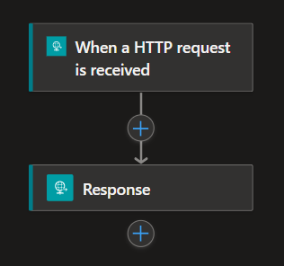

## Background   
Logic Apps is a flexible service that provides you with the tools to implement tasks in various ways. Having more options is often beneficial, but sometimes it can be a bit confusing. How do you determine when to use which method and under what circumstances? Is there a method that is faster or slower?

In this post, we will explore three different methods to implement if statements in Logic Apps. We will conduct benchmarks and compare the results.

##  Exploring Alternatives to If statements 🏴󠁲󠁯󠁩󠁦󠁿
As you start developing, you will encounter if statements quite quickly; they serve as control mechanisms to decide actions based on values. In Logic Apps, the Condition action is the counterpart of if statements, but there are alternative actions and functions that you could use, such as the Inline Code action and `if` Expression. Each of these methods comes with its perks and limitations!

### Condition action
Works similarly to an if-else statement. The action will return either true or false, executing one of the paths. The <a href="https://learn.microsoft.com/en-us/azure/logic-apps/logic-apps-control-flow-conditional-statement?tabs=consumption" target="_blank" rel="noopener noreferrer">Condition action</a> supports your classic logical operations such as:

- `or`, only one of the statements has to be `true` for the action to return true.
- `and`, all of your statements have to be `true` in order for the action to return true.
- The option to group statements, to create more complex statements.

### Expression
<a href="https://learn.microsoft.com/en-us/azure/logic-apps/workflow-definition-language-functions-reference" target="_blank" rel="noopener noreferrer">Expressions</a> can be used for various purposes. For instance, there are functions for date-time operations, logical operations, and collection operations, to mention a few. One expression we are a bit more interested in is the `if` function, and it is often combined with other functions, as shown below:
```
if(equals(a,10),a,null)
```
One feature of Expressions is the ability to nest them. By nesting expressions, you can create complex statements and outputs. However, when nesting functions and operations together with other outputs from previous actions, readability can become challenging. Therefore, it is best practice not to overuse this feature.

### Inline Code action
Allows you to run "vanilla" JavaScript code within Logic Apps and can be used for a vast variety of tasks. The <a href="https://learn.microsoft.com/en-us/azure/logic-apps/logic-apps-add-run-inline-code?tabs=consumption" target="_blank" rel="noopener noreferrer">Inline code action</a> can utilize outputs from other actions and can also `return` the output of the code, which, in turn, can be used in other actions in your workflows.

## The Benchmark ⏱️
### Use Case: Array Processing and Conditional Record Handling
This benchmark will center around a straight forward use case on data processing and conditional handling. To get a better data sample of the performance, we will increase the amount of records by 500, up to 10000 records. 

The input arrays was generated with the <a href="https://json-generator.com/" target="_blank" rel="noopener noreferrer">Json Generator</a>, and had the following template:
```

```

### Scenario Description:
1. **Loop Over array:**
   - Once the array is retrieved, iterate over individual records within the array.

2. **Conditional Handling:**
   - If the number is equal to 20, 30, or 40. Then return the number, else return `null`

### Workflow implementation
We will implement a orchestration workflow that will loop over the items and call the other the workflows e.g Condition, Expression and Javascript. 

The full project with workflows and generated files can be viewed at my <a href="https://github.com/antonidag/logic-app-condition-vs-switch" target="_blank" rel="noopener noreferrer">GitHub</a>.

Let's point out some important difference between the workflows:

- __The Condition__ uses the Condition action with the `or` option, either returning the number or `null` in separated Response actions.


- __The Expression__ uses nested if expressions in the Response action.


- __The Inline Code__ uses JavaScript code to return the output which is later used in the Response action.


### Environment settings
All the benchmarks will be using a WS2 App Service Plan, the scale out settings was limited to 1. 
The workflows mode was set to the `Stateful` mode and the concurrency settings had the default, meaning that Logic App will process several records at the same time. 

## Result 📊

### Time per element in seconds

### Difference compared to Condition action in seconds


### Average time per element in seconds
- Expression: __0.231__
- Condition: __0.264__
- Inline code: __0.461__
## Reflections

The results from these benchmarks are not to be seen as right and wrong, meaning that one or the other method is better or worse. There is a lot more parameters to take in and look at before having a proper result. In these benchmark we only look at the duration of the workflows.

Anyway, with this in mind the diagrams shows that the Expression implementation resulted in lower time per element in seconds. When comparing this to the Condition workflow, it will give us around 14% performance gain on average. One big surprise with was that the Inline Code implementation, was on avg rounded 43% slower per element! I do not know how the Inline code action works under the hood, but probably there is some overhead with Node process that is running the code and somehow causing this big performance decrease.  

If we glance at the diagrams there seams to be a pattern that correlates with the amount of elements, the time per element eventually goes down. This seems to be true for all the implementations and is not isolated to one workflow. I think this is related to the Logic Apps scale out mechanism at a sertant amount of elements we start to "win back" the overhead and therefor we seeing this trend.


I think interesting next steps would be to create a more complex nested statement, to see if there we will get the same results or will it be any difference between the implementation. Perhaps in such a case the Inline Code action will preform better? Another step would be to increase the amount of elements in the input arrays up to 100 000 elements to explore Logic App will behave if the trend shown will be flatten or keep improving, where is the break point? 


