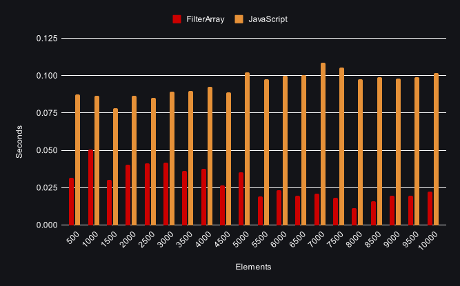

## Background
Optimizing your Logic App for better performance is a hot topic and there is lot best practices and material for instance this blog [post](https://techcommunity.microsoft.com/t5/azure-integration-services-blog/using-inline-code-instead-of-a-foreach-loop-for-better/ba-p/3369587) from Microsoft explaining that Inline Code is an option instead of using the For Each action. In this blog post we will conduct a benchmark between the Logic Apps actions For Each, Filter Array and Inline Code inorder to get more insight on how the different actions performs! 

## Exploring options For loops
Loop over an array of elements is one of bread and butter when it comes programming, in Logic Apps this is normally perform by the [For each](https://learn.microsoft.com/en-us/azure/logic-apps/logic-apps-control-flow-loops?tabs=consumption#foreach-loop) action. But there are many ways to interact with a collection such as [Inline Code](https://learn.microsoft.com/en-us/azure/logic-apps/logic-apps-add-run-inline-code?tabs=consumption), [Liquid Transformation](https://learn.microsoft.com/en-us/azure/logic-apps/logic-apps-enterprise-integration-liquid-transform?tabs=consumption), [Data Operations](https://learn.microsoft.com/en-us/azure/logic-apps/logic-apps-perform-data-operations?tabs=consumption) and even [Expressions](https://learn.microsoft.com/en-us/azure/logic-apps/workflow-definition-language-functions-reference). Some of methods mention are more limited and others are more free on what you can do, so depending on the logic you would like to implement some method might more suitable than others. 
For example if you would like to filter an collection based on property the Filter action is a good option, but if you would like to reverse an array you can simply use the `reverse` [Expression](https://learn.microsoft.com/en-us/azure/logic-apps/workflow-definition-language-functions-reference#reverse).

### For Each
This action allows you loop over a collection, by default iterations will run at the same time in parallel. There are limitation related to the For Each action depending on if you run Logic App Consumption or Standard. The devil is in the details, but generally the For Each can only loop over 100,000 items and the concurrency is by default set to `20` and with a max at `50`. Read more about the limitation [here](https://learn.microsoft.com/en-us/azure/logic-apps/logic-apps-limits-and-config?tabs=consumption#looping-debatching-limits).

### Filter Action
[Filter array]() action is apart of the Data Operations family, which allows you to create a subset of items based on a criteria. The action takes a collection as input and can filter the array on a property equal a specific value. The action can not transform the output into a different format or alter any items, instead these operations has to be done in a later actions.  

### Inline Code action
Allows you to run "vanilla" JavaScript code within Logic Apps and can be used for a vast variety of tasks. The action can utilize outputs from other actions and can also `return` the output of the code, which, in turn, can be used in other actions in your workflows.

## The Benchmark
This benchmark focus around on a use case where there is a need to filter a collection and adding a property on the subset of the remaining items. We will increase the amount of elements by 500, starting at 500 going up to 10,000 elements. The benchmark will be performed on three different implementations, each focusing on a different Logic App action:
- For Each with Condition action
- Filter Array with For Each action
- and Inline Code action

The files for this benchmark was generated by [dummy-data-cli](https://github.com/antonidag/dummy-data-cli). Its a tool built for generating dummy data based on JavaScript templates. The following template was used: 
```
export function main(index) {
    return `
    [
      {{#repeat ${index}}}
      {
        "id": {{@index}},
        "name": "{{firstName}} {{lastName}}",
        "work": "{{company}}",
        "email": "{{email}}",
        "dob": "{{date '1900' '2000' 'YYYY'}}",
        "address": "{{int 1 100}} {{street}}",
        "city": "{{city}}",
        "optedin": {{boolean}},
        "coordinates": {
          "x": {{float -50 50 '0.00'}},
          "y": {{float -25 25 '0.00'}}
        },
        "price": "$ {{int 0 99999 '0,0'}}",
        "status": "{{random 'active' 'inactive' 'paused' }}"
      }
      {{/repeat}}
    ]`
}
``` 

### Scenario Description:
1. **Read/Input Array**
2. **Loop Over Array:**
   - Once the array is retrieved, iterate over individual elements within the array.
3. **Conditional Handling:**
   - Filter out objects based on status equal to `active`
4. **Add/enrich elements with additional data**
  - Add `batchId` with a uuid string
5. **Return filtered array with enriched data**

The order of the operations is not necessarily needed to be followed, the important is that the input array is filtered and individual items are enriched with more data.

### Workflow implementation
For simplicity all the workflows will return back a `202 Accepted` to the client once a request is received, and allows for the rest of the workflow to continue its execution and process the payload. 

__For each__ uses a Condition inside of the For Each action 


__Filter Action with For each__ uses the Filter Array before looping over the elements with a For Each action


__Inline Code__ using JavaScript to filter and loop over the collection


Want more details, make sure to view my github [project](https://github.com/antonidag/logic-app-for-each-benchmark)!

### Environment settings
All the benchmarks will use the same resource setup: 
- WS1 App Service Plan. The scale out burst and minimum were set to 1 instances.
- Logic Apps Standard, with scale out setting set to 1 `Always Ready Instances`. 
- Workflow mode was set to the `Stateful` mode, and the concurrency settings remained at default, meaning that Logic App will process several elements simultaneously.

## Result

### Time per element in seconds

### Difference compared to For Each action in seconds

### Average time per element in seconds
- For each with Condition: __0.095__
- Filter Array with For Each: __0.067__
- Inline Code: __0.00049__

## Reflections

Before the results are to be analyzed it is important to mention that the results are not to be seen at good or bad, there are many factor to consider that can affect the performance. As for this benchmark we only focused on the duration of the workflows.

Just by a quick screening we can see that the Inline Code implementation crushes its competition by being chocking `0.095 / 0.00049 ≈ 194.0` 194x times faster than the For Each, and `0.067 / 0.00049 ≈ 137.0` 137x times faster than Filter Array implementation. I do not think we need to calculate any more numbers, just by having these metrics and the an average time per elements of __0.00049__ seconds, it tells us its quite fast in this context! How come we get this get these results? One of the reason for this could be that JavaScript action runs within a single execution context, minimizing the overhead associated with action-by-action processing.

If we look over to the Filter Array implementation combined with For Each action, it defiantly falls a bit under shadow when compared with Inline Code implementation. As the [time per element chart](#time-per-element-in-seconds) is indicating is some kind of performance decrease over time as the numbers of elements grows. Why is the trend? 
Anyway, if we compared this to the For Each we can calculate the speed up by `0.095 / 0.067 ≈ 1.4`. Around 1.4x times faster just adding a filter and only letting the For Each action run with a subset of elements. As for the performance gain on average in reduced execution time it is approximately __29.0%__, calculated with the following `(0.095 - 0.067) / 0.095 * 100 ≈ 29.0`.

Lastly the elephant in the room For each action. It was impressive to see that it had such stable performance regardless of the amount of elements. Unfortunately it performed the worse out the three methods, it somewhat excepted since we know that there is a lot of over head the actions.  

Does this mean that you always should do everything with JavaScript? No, probably you do want that and with a very large sized collection, consider chunking the array to smaller pieces and etc. 

Should a Logic App process a lot of data? Perhaps no, but in a case where it is need the Javascript implementation should at least be considered. 


in an blog post from Microsoft it gives you tips in ways you can optimizes your workflow and etc...


Except for the performance we will also try and rate how eazy/hard it is to debug and development.

Did you enjoy read this? Interested in more benchmarks make sure to check my post about [Choosing the Quickest Logic App Condition!🏎️](/posts/benchmark-condition)!