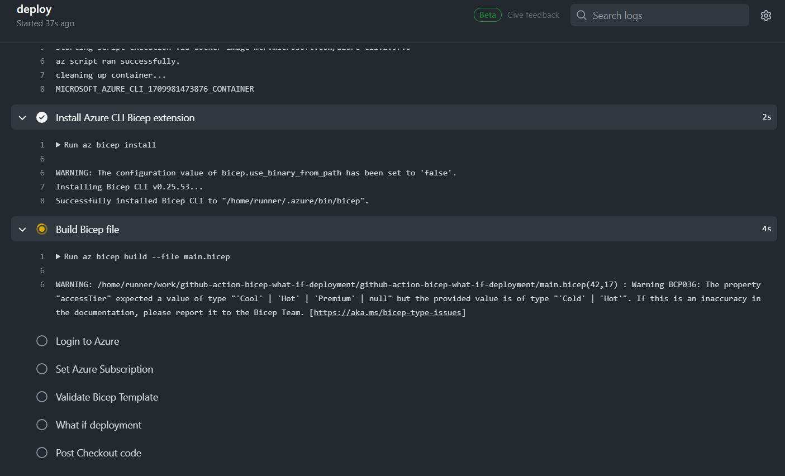

## Background
There are many ways to guarantee that the right resources are deployed. Most likely, this is managed by peer reviews or some other process. However, looking at code and determining the changes is not always a simple task. How do you know what is being changed or created when you deploy infrastructure?

In this blog, we will dive into <a href="https://learn.microsoft.com/en-us/azure/azure-resource-manager/bicep/" target="_blank" rel="noopener noreferrer">Bicep</a> what-if deployments and how they can help deploy the right thing! We will do this by creating a GitHub Action pipeline using the <a href="https://learn.microsoft.com/en-us/cli/azure/?view=azure-cli-latest" target="_blank" rel="noopener noreferrer">Azure CLI</a> to build, validate, and perform a what-if deployment.


## Creating a safe, secure and predictable deployments ☔

__What we are trying to achieve?__
Our goal is to create safe, secure, and pain-free deployments while improving the overall quality and clarity. There are various methods that can help improve deployments to Azure, but we are going to focus on the Bicep tools. Here are some steps you could take to enhance your pipeline deployments to Azure right now:
- __Build the Bicep template__

  *Why do we want to build our Bicep template?* Ensures that there is no syntax errors. Additionally, this step will also help identify warnings with your template.
- __Validate the deployment__

  *Why should we validate the deployment?* This ensures that the template is valid for a deployment to the resource group. 
- __Preform a What-if deployment__

  *Why preform a What-If deployment?* Before deploying a Bicep template, we can preview the changes. This additional step ensures the right resources are deployed and provides a extra safety net.
 
## Building Bicep Templates 🏗️

Create a new file `main.bicep` and paste in the code below:
```
param location string
param storageName string
param kind string
param skuName string
param accessTier string

resource storageAccount 'Microsoft.Storage/storageAccounts@2019-06-01' = {
  sku: {
    name: skuName
  }
  kind: kind
  name: storageName
  location: location
  properties: {
    accessTier: accessTier
    supportsHttpsTrafficOnly: true
    minimumTlsVersion: 'TLS1_2'
  }
}
```
This Bicep template will deploy a `Storage Account` of some type, depending on the parameters used as input. 

Create a other file `main.bicepparm`, adjust the parameters to your liking:
```
using './main.bicep'

param location = 'northeurope'
param storageName = 'mystr123'
param kind = 'StorageV2'
param skuName = 'Standard_LRS'
param accessTier = 'Hot'
```
A `.bicepparm` files are used to parameterize your `main.bicep` template file.

## Running az cli commands locally 🏃‍♂️
It is a good start to reproduce the steps locally on our machine. If you have not already installed Azure CLI, go ahead and download it. Once installed, you will also need to install the Bicep extension. This can be done by simply running the following command:

```
az bicep install
```
__Step 1:__ Login to Azure

```
az login
```
This will prompt a new window in your browser and allow you to login to your account.

__Step 2:__ Set the subscription
```
az account set --subscription {SUBSCRIPTION_ID} 
```
It makes things easier to specify which subscription we are working with so that we do not accidentally deploy to the wrong one.

__Step 3:__ Build Bicep template 
```
az bicep build --file main.bicep
```
After you have run this command, if everything went fine, a new file `main.json` will be created.


__Step 4:__ Validate the deployment
```
az deployment group validate 
--resource-group {RESOURCE_GROUP} 
--name ValidateDeployment  
--template-file main.bicep 
--parameters main.bicepparam
```
As mentioned earlier, this step will validate the template in the resource group. In our case, the template used is simple but in real scenario these templates could become quite complex, making it harder to spot errors. Hopefully this step will catch these type of errors.


__Step 5:__ Perform a What-if deployment
```
az deployment group what-if 
--resource-group {RESOURCE_GROUP} 
--name WhatIfDeployment 
--template-file main.bicep 
--parameters main.bicepparam
```
If successful, an output shown below will be printed in the terminal:
```
Resource and property changes are indicated with these symbols:
  + Create
  
The deployment will update the following scope:

Scope: /subscriptions/{SUBSCRIPTION_ID}/resourceGroups/{RESOURCE_GROUP}

  + Microsoft.Storage/storageAccounts/mystr123 [2023-01-01]

      apiVersion:                          "2023-01-01"
      id:                                  "/subscriptions/{SUBSCRIPTION_ID}/resourceGroups/{RESOURCE_GROUP}/providers/Microsoft.Storage/storageAccounts/mystr123"
      kind:                                "StorageV2"
      location:                            "northeurope"
      name:                                "mystr123"
      properties.accessTier:               "Hot"
      properties.minimumTlsVersion:        "TLS1_2"
      properties.supportsHttpsTrafficOnly: true
      sku.name:                            "Standard_LRS"
      type:                                "Microsoft.Storage/storageAccounts"

Resource changes: 1 to create.
```
Here we can clearly see the resources being deployed, their name, sku and all the necessary information. We also get a summery as you can se on the last row of resources changed, created and ignored. Sending this to your colleague for review would be much appreciated and easy to understand. Compare this to code-review for an example, the reviewer needs to have knowledge around the language Bicep its syntax, logic and structure. If you are like me, and does not always make the perfect pull requests, the reviewer might end up reviewing a lot of code, which can make it hard to get a proper overview of the impacted resources. 

If we combine these steps, we can build a stable, robust and predictable deployment process and catch errors before it is too late.

## Setting up Github Action pipeline ⚙️

Before diving into the setup process, there are a few prerequisites to address:
- __Create a Service Principal in Azure:__ This provides the necessary permissions for the GitHub Action to interact with your Azure resources.
- __Set up a GitHub Project:__ Create a project in GitHub and set up an Environment within your project.
- __Add GitHub Secrets:__ Store credentials securely as GitHub secrets to ensure they are not exposed in your repository.

Create a new folder `.github/workflows` and a file `what-if.yml` and paste in the code:
```
name: Bicep What if deployment
on:
  workflow_dispatch:
jobs:
  deploy:
    runs-on: ubuntu-latest
    environment: GITHUB_ENVIRONMENT
    steps:
      - name: Checkout code
        uses: actions/checkout@v2
      
      - name: Set up Azure CLI
        uses: Azure/cli@v1.0.9
        with:
          inlineScript: true
          
      - name: Install Azure CLI Bicep extension
        run: az bicep install
      
      - name: Build Bicep file
        run: az bicep build --file main.bicep

      - name: Login to Azure
        run: az login --service-principal -u ${{ secrets.AZURE_USERNAME }} -p ${{ secrets AZURE_USER_PASSWORD }} --tenant ${{ secrets.AZURE_TENANT_ID }}

      - name: Set Azure Subscription
        run: az account set --subscription ${{secrets.SUBSCRIPTION_ID}}
      
      - name: Validate Bicep Template
        run: az deployment group validate --resource-group ${{secrets.RESOURCE_GROUP}} --name ValidateDeployment --template-file main.bicep --parameters main.bicepparam

      - name: What if deployment
        run: az deployment group what-if --resource-group ${{secrets.RESOURCE_GROUP}} --name WhatIfDeployment --template-file main.bicep --parameters main.bicepparam
```
This pipeline can serve as a starting for automating what-if deployments in your Azure environment, but will probably need to be customized to fit your organization. For more details the full project code and be viewed at my GitHub repository <a href="https://github.com/antonidag/github-action-bicep-what-if-deployment" target="_blank" rel="noopener noreferrer">here</a>.

After the setup you can trigger the pipeline and it will start deploying to Azure:   



That's it! We have managed to create a what-if pipeline!

## Reflections
Some key take away are that using Azure CLI together with Bicep to build, validate and preform a what-if deployment is an excellent way to setting yourself up for success. It might feel like much work and many steps, but if we can mitigate failures we will probably save a lot of time and hassle! With a creative mind, the information given from what-if deployments could easily turn into documentation, change logs or release notes. 

Have you integrated what-if deployments in your pipeline? What is your experience with CI/CD in your organizations? Share your insights and experiences in the comments below!