## Background   
Everyone loves when an system can handle/react fast and make it feel like seamless operation. This is true whether it is in a large scale enterprise or a in smaller organization. How fast systems can handle requests can be a complicated chain of services communicating with each other, therefor optimizations and performance improvements are an important task we developers need to deal with.

In this post we will look at three difference ways to implement if statements in Logic Apps, to see if there is any performance difference. We will conduct a benchmark on a real world senario and by compare the results.

But let's first go thru the ways uu could implement if statements in Logic Apps!

## Understanding if:s in Logic Apps
As you delve into Logic Apps, you'll encounter if statements quite swiftly; they serve as control mechanisms to decide actions based on values. In Logic Apps, if statements are implemented as Condition action, but there are alternative methods, such as the JavaScript action and the if expression. Each of these methods comes with its unique limitations, perks, and useage!
1. The Condition action functions simliar to an if-else statement. Depending on the condition, the action will return either a true or false outcome, triggering the execution of either path. While in programming languages like C#, it is common to create a chain of if-else statements, this feature is not exactly supported in the Logic App Condition action. Instead, you have to create multiple Condition actions to build up the same chain of if-else statements. Let's look at the pseudo-code below for a better understanding:

```
// Example of chaining if-else statements, in programming language as C#
if (a == 10){
    return a;
} else if (a == 20){
    return a;
} else if (a == 30){
    return a;
} else {

}


// Example how the Logic Apps Condition action implements if-else
if (a == 10){
    return a;
} else {

}
if (a == 20){
    return a;
} else {

}
if (a == 30){
    return a;
} else {

}
```
2. The Javascript action can also be used for implementation if-else, this a pretty straight forward you can run javascript and does give us the option to make a something

3. Using expression if, the expression in Logic Apps can be used in numerous places to help and ease the implementation and simplify expressions that you would like to do. The if expression works very similar to tanary operator.
## The Benchmark
### Use Case: Array Processing and Conditional Record Handling

It is common in the real-world that data needs to be filtered and then processed based on various conditions. This benchmark will center around a straight forward use case on data processing. To get a better data sample of the performance, we will increase the amount of records by 500, up to 10000 records. 

#### Scenario Description:
1. **Loop Over array:**

   - Once the array is retrieved, the iterate over individual records within the array.

2. **Conditional Handling:**
   - The first set of conditions involves checking if the number is equal to specific values, namely 10, 20, or 30.
   - If the condition is met, then process the data.

### Data source
Files was generated with the <a href="https://json-generator.com/" target="_blank" rel="noopener noreferrer">Json Generator</a> tool, the following template generates an array with the numbers of 0, 10

### Workflow implementation
To mimic the senareio and keep the implementation as simple as possible, we will expose an end-point where we can post an array of numbers. The workflows will start will an Request trigger and then followed by the For Each action. The difference in the workflows only be Switch and Condition actions implementation.
#### Condition
to optimize for performance we will utilize the run in parallel action.

#### Switch

### Environment settings
All the benchmarks was be using a WS1 App Service Plan, the scale out settings was limited to 1. 
The workflows concurrency For Each settings will be default, meaning that Logic App will process several records at the same time. 

## Result

## Conclusion

## Summary
