## Background   
Logic Apps is a flexible tool that provides you with the opportunity to implement tasks in various ways. Having more options is often beneficial, but at times, it can be a bit confusing. How do you determine when to use what and under what circumstances? Is there any performance difference?

In this post, we will explore three different ways to implement if statements in Logic Apps to assess potential performance differences and examine the various implementations. We will conduct a benchmark and compare the results.

##  Exploring Alternatives to If statements
As you start developing workflows, you will encounter if statements quite quickly; they serve as control mechanisms to decide actions based on values. In Logic Apps, if statements are commonly used with the Condition action, but there are alternative actions and functions that you could use, such as the JavaScript action and if expression. Each of these methods comes with its perks and limitations!

### Condition action
Works similarly to an if-else statement. Depending on the condition, the action will return either true or false, executing one of the paths. In programming languages like C#, it is common to create a chain of if-else statements. However, this feature is not supported in the Logic App Condition action. Instead, you have to create multiple Condition actions to build up the chain of if-else statements. It is also possible to nest your Condition actions.
```
// Pseudo-code of chaining Condition actions
if (a == 10){
    return do();
} else {

}
if (a == 20){
    return doMore();
} else {

}
if (a == 30){
    return doEvenMore();
} else {

}
return null;

//Pseudo-code of nesting Condition actions
if (a == 10){
    return do();
} else {
    if (a == 20){
        return doMore();
    } else {
            if (a == 30){
                return doEvenMore();
            } else {
                return null;
        }
    }
}

```
### If Expression
Expressions in Logic Apps are a sequence that can contain one or more functions, operators, variables, explicit values, or constants. One of these expressions is the function `if`, often combined with other functions, as shown below:
```
if(equals(a,10),a,null)
```
A notable feature of Expressions is the ability to nest them. However, when nesting `if` functions, readability can become challenging. Therefore, it is a best practice not to overuse this feature. 
```
if(equals(a,10),a,if(equals(a,20),a,if(equals(a,30),a,null)))
```

### JavaScript action
Allows you to run "vanilla" JavaScript code within Logic Apps and can be used for a vast variety of tasks. The action can utilize outputs from other actions and can also `return` the output of the code, which, in turn, can be used in other actions in your workflows.

## The Benchmark
### Use Case: Array Processing and Conditional Record Handling
This benchmark will center around a straight forward use case on data processing and conditional handling. To get a better data sample of the performance, we will increase the amount of records by 500, up to 10000 records. 

#### Scenario Description:
1. **Loop Over array:**
   - Once the array is retrieved, the iterate over individual records within the array.

2. **Conditional Handling:**
   - If the number is equal to 10, 20, or 30. Then return the number.

### Workflow implementation
This benchmark will be implementing a orchestration workflow that will loop over the items and call the different implementations. 
#### Condition action

#### Expression if

#### Javascript action

### Environment settings
All the benchmarks was be using a WS1 App Service Plan, the scale out settings was limited to 1. 
The workflows concurrency For Each settings will be default, meaning that Logic App will process several records at the same time. 

### Data source
Files was generated with the <a href="https://json-generator.com/" target="_blank" rel="noopener noreferrer">Json Generator</a> tool, the following template generates an array with the numbers of 0, 10, 20, 30, 40, 50.

## Result

## Conclusion

## Summary
