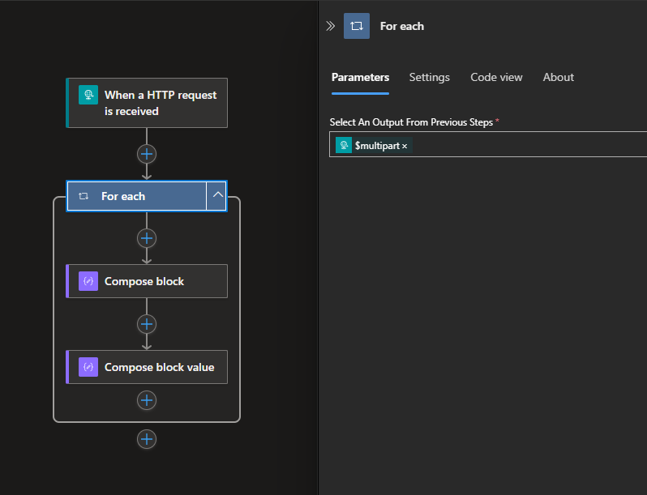
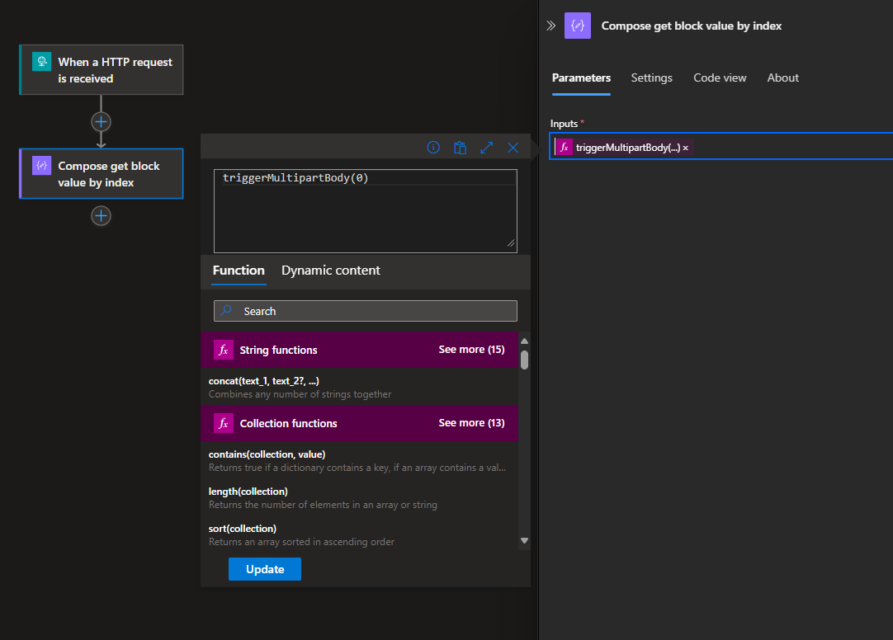
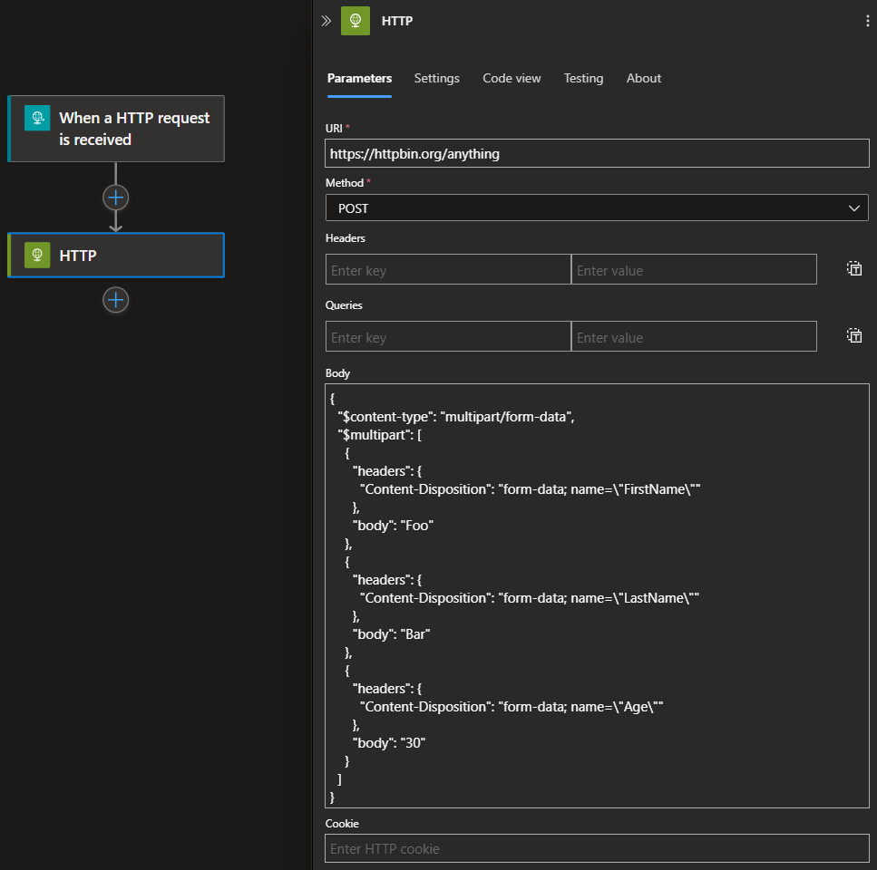

## Background 
The support for working with `json`, `xml`, or text files is great in Logic Apps. However, sometimes there may be a need to send a customized message or a request to a service, and those can be a bit more challenging. In this guide, we will specifically look into the content type known as `multipart/form-data`!

## What is the Content-Type HTTP header?🏷️
The `Content-Type` HTTP header describes the format of the payload in both HTTP requests and responses, allowing the receiving side to correctly decode or parse the data. There are different content types, with `application/json` and `application/xml` being the most common in REST APIs. It is important not to confuse `Content-Type` with `Content-Encoding`, which refers to how the resource is encoded.

### What is multipart/form-data?
Let’s continue with the content type `multipart/form-data`. You will likely encounter this when working with HTML forms. For example, a user may need to submit their first and last name while also attaching a file. There are other implementations where the `multipart/form-data` content type is used, but this should give you an idea of where you might encounter it.

Let's say that we have an HTML form that will submit the following fields to our backend service: 
- Age 
- First name
- and Last name

How does it look and work? Below is an example of a raw HTTP post request with `multipart/form-data` using the Postman client:
```
POST /anything HTTP/1.1
Host: httpbin.org
Content-Type: multipart/form-data; boundary=--------------------------671747156319508458970968
 
----------------------------671747156319508458970968
Content-Disposition: form-data; name="Age"
30
----------------------------671747156319508458970968
Content-Disposition: form-data; name="FirstName"
Foo
----------------------------671747156319508458970968
Content-Disposition: form-data; name="LastName"
Bar
----------------------------671747156319508458970968--
```
One thing that stands out in the payload body, is that the content is sent as blocks of data. Each block is separated by a `boundary` value, which separates each segment. Within each block, the `Content-Disposition` header is declared, containing information and metadata about the form data block, for example field name.

It is also important to mention that the `boundary` value is part of the specification and must be implemented by the sending party. However, in most cases, the value is auto-generated by tools and libraries, rather than being manually defined by the user.

## Multipart/form-data with Logic Apps
### Read data 👀
Start by creating a simple workflow using the <a href="https://learn.microsoft.com/en-us/azure/connectors/connectors-native-reqres?tabs=consumption" target="_blank" rel="noopener noreferrer">Request trigger</a> connector. If we post the same request described in the section [What is multipart/form-data?](#what-is-multipartform-data) but now we instead call this workflow and head into to the trigger output, you will have something similar to this: 

```
// Some fields in the output has been removed for readability. 
{
    "headers": {
        "Content-Type": "multipart/form-data; boundary=--------------------------493073486649885477988289"
    },
    "body": {
        "$content-type": "multipart/form-data; boundary=--------------------------493073486649885477988289",
        "$content": "LS0tLS0tLS0tLS0tLS0tLS0tLS0tLS0tLS0tLTQ5MzA3MzQ4NjY0OTg4NTQ3Nzk4ODI4OQpDb250ZW50LURpc3Bvc2l0aW9uOiBmb3JtLWRhdGE7IG5hbWU9IkZpcnN0TmFtZSIKCkZvbwotLS0tLS0tLS0tLS0tLS0tLS0tLS0tLS0tLS0tNDkzMDczNDg2NjQ5ODg1NDc3OTg4Mjg5CkNvbnRlbnQtRGlzcG9zaXRpb246IGZvcm0tZGF0YTsgbmFtZT0iTGFzdE5hbWUiCgpCYXIKLS0tLS0tLS0tLS0tLS0tLS0tLS0tLS0tLS0tLTQ5MzA3MzQ4NjY0OTg4NTQ3Nzk4ODI4OQpDb250ZW50LURpc3Bvc2l0aW9uOiBmb3JtLWRhdGE7IG5hbWU9IkFnZSIKCjMwCi0tLS0tLS0tLS0tLS0tLS0tLS0tLS0tLS0tLS00OTMwNzM0ODY2NDk4ODU0Nzc5ODgyODktLQ==",
        "$multipart": [
            {
                "headers": {
                    "Content-Disposition": "form-data; name=\"FirstName\"",
                    "Content-Length": "3"
                },
                "body": {
                    "$content-type": "application/octet-stream",
                    "$content": "Rm9v"
                }
            },
            {
                "headers": {
                    "Content-Disposition": "form-data; name=\"LastName\"",
                    "Content-Length": "3"
                },
                "body": {
                    "$content-type": "application/octet-stream",
                    "$content": "QmFy"
                }
            },
            {
                "headers": {
                    "Content-Disposition": "form-data; name=\"Age\"",
                    "Content-Length": "2"
                },
                "body": {
                    "$content-type": "application/octet-stream",
                    "$content": "MzA="
                }
            }
        ]
    }
}
```

At first glance, this might look a bit cryptic, and it does not exactly remind you of the request that was sent from the Postman client. This is because Logic Apps has converted the payload into a `json` format and the blocks in the `multipart-form` have been converted into an array, which can be found under the `$multipart` property.

Each object in the multipart array contains a `header` and a `body`. The `header` provides the metadata such as field name, which is useful when you want to filter out on specific fields. The `body` contains the data and in this case is represented as `application/octet-stream`, which simply means that Logic Apps is keeping the content "intact". 

It is worth mentioning that the value of the `$content` property is the raw HTTP body and can be decoded using base64.

There are two ways to read these kinds of payloads in Logic Apps:  
- you can either loop over the `$multipart` array to extract the data. 
- or you can use one of the expression, <a href="https://learn.microsoft.com/en-us/azure/logic-apps/workflow-definition-language-functions-reference#multipartBody" target="_blank" rel="noopener noreferrer">multipartBody</a> or <a href="https://learn.microsoft.com/en-us/azure/logic-apps/workflow-definition-language-functions-reference#triggerMultipartBody" target="_blank" rel="noopener noreferrer">triggerMultipartBody</a>, which require an index as input to get the data. 


Using the For each action and looping over the `$multipart` property: 


And an example of using the expression `triggerMultipartBody` and selecting the index `0` in the multipart array:



### Send data ✉️
In order to send a `multipart/form-data` payload we need to use the <a href="https://learn.microsoft.com/en-us/azure/connectors/connectors-native-http?tabs=standard" target="_blank" rel="noopener noreferrer">HTTP connector</a> and compose a similar body that was seen in the [Read the data](#read-the-data) section, a `json` body with the `$content-type` and `$multipart` array property. Create another workflow and copy in the code below and paste into HTTP connector body: 

```
{
  "$content-type": "multipart/form-data",
  "$multipart": [
    {
      "headers": {
        "Content-Disposition": "form-data; name=\"FirstName\"",
      },
      "body": "Foo"
    },
    {
      "headers": {
        "Content-Disposition": "form-data; name=\"LastName\"",
      },
      "body": "Bar"
    },
    {
      "headers": {
        "Content-Disposition": "form-data; name=\"Age\"",
      },
      "body": "30"
    }
  ]
}

```
Notice that we did not set the `boundary` value since this gets auto generated by HTTP connector. You can test this workflow by calling the former workflow to make sure it works as intended. 

Below is the final code configuration for sending a `multipart/form-data` message: 


## Reflections

Once you figure out how the HTTP connector works with its syntax, it works quite well. You will probably need to do some additional quirks and fixes to make sure the data is sent correctly.