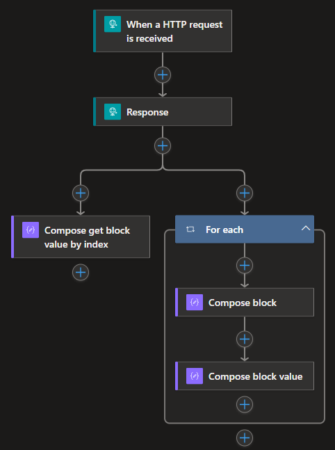

## Background 
The support for working with `json`, `xml`, or text files is great in Logic Apps. However, sometimes you need to send a customized message or a request to a service. In some cases, you need to be able to handle a different content types than your typical `json` or `xml` payloads, and those can be a bit more challenging. In this guide, we will specifically look into the less commonly used media content type: `multipart/form-data` payloads!

## What is the Content-Type HTTP header?🏷️
The `Content-Type` HTTP header describes the format of the payload in both HTTP requests and responses, allowing the receiving side to correctly decode or parse the data. There are differnt content types, with `application/json` and `application/xml` being the most common in REST APIs. It is important not to confuse `Content-Type` with `Content-Encoding`, which refers to how the resource is encoded.

### What is multipart/form-data?
Let’s continue with the content type `multipart/form-data`. You will likely encounter this at least in my experience, when working with HTML forms. For example, a user may need to submit their first and last name while also attaching a file. There are other implementations where the `multipart/form-data` content type is used, but this should give you an idea of where you might encounter it.

Okay, but how does it look and work? Below is an example request for sending `multipart/form-data` using the Postman client:
```
POST /anything HTTP/1.1
Host: httpbin.org
Content-Type: multipart/form-data; boundary=--------------------------671747156319508458970968
 
----------------------------671747156319508458970968
Content-Disposition: form-data; name="Age"
30
----------------------------671747156319508458970968
Content-Disposition: form-data; name="FirstName"
Foo
----------------------------671747156319508458970968
Content-Disposition: form-data; name="LastName"
Bar
----------------------------671747156319508458970968--
```
This is the raw HTTP request taken from the Postman console. One thing that stands out in the payload body is that the content is sent as blocks of data. Each block is separated by a `boundary` value, which seperates each segment. Within each block, the `Content-Disposition` header is declared, containing information and metadata about the form data block, for example field name and filename.

It is also important to mention that the `boundary` value is part of the specification and must be implemented by the sending party. However, in most cases, the value is auto-generated by tools and libraries, rather than being manually defined by the user.

In the example above, you can see that we have three blocks of data: Age, FirstName and LastName. The value of each `key` can be found under the `Content-Disposition` header. For instance, the value for Age is `30`, while FirstName is `Foo`, and so on.

If it is still unclare head over this this source to read [more](https://developer.mozilla.org/en-US/docs/Web/HTTP/Methods/POST) [Content-Disposition](https://developer.mozilla.org/en-US/docs/Web/HTTP/Headers/Content-Disposition).


## Multipart/form-data with Logic Apps
Now we pretty much know a bunch of things, but how does it work within Logic Apps? 
Logic Apps likes to talks in JSON, which can make things a bit confusing but let's break it down. 

### Read the data 👀
Created a simple HTTP trigger workflow using Logic App Standard. If we post the same request describe in the section [What is multipart/form-data?](#what-is-multipartform-data) but now we instead call this workflow and look in trigger output, you will have something similar to this: 

```
// Some fields in the output has been removed for readablity. 
{
    "headers": {
        "Content-Type": "multipart/form-data; boundary=--------------------------493073486649885477988289"
    },
    "body": {
        "$content-type": "multipart/form-data; boundary=--------------------------493073486649885477988289",
        "$content": "LS0tLS0tLS0tLS0tLS0tLS0tLS0tLS0tLS0tLTQ5MzA3MzQ4NjY0OTg4NTQ3Nzk4ODI4OQ0KQ29udGVudC1EaXNwb3NpdGlvbjogZm9ybS1kYXRhOyBuYW1lPSJGaXJzdE5hbWUiDQoNCkZvbw0KLS0tLS0tLS0tLS0tLS0tLS0tLS0tLS0tLS0tLTQ5MzA3MzQ4NjY0OTg4NTQ3Nzk4ODI4OQ0KQ29udGVudC1EaXNwb3NpdGlvbjogZm9ybS1kYXRhOyBuYW1lPSJMYXN0TmFtZSINCg0KQmFyDQotLS0tLS0tLS0tLS0tLS0tLS0tLS0tLS0tLS0tNDkzMDczNDg2NjQ5ODg1NDc3OTg4Mjg5DQpDb250ZW50LURpc3Bvc2l0aW9uOiBmb3JtLWRhdGE7IG5hbWU9IkFnZSINCg0KMzANCi0tLS0tLS0tLS0tLS0tLS0tLS0tLS0tLS0tLS00OTMwNzM0ODY2NDk4ODU0Nzc5ODgyODkNCkNvbnRlbnQtRGlzcG9zaXRpb246IGZvcm0tZGF0YTsgbmFtZT0iQWRkaXRpb25hbEluZm8iDQoNCkhlbGxvIFdvcmxkIQ0KLS0tLS0tLS0tLS0tLS0tLS0tLS0tLS0tLS0tLTQ5MzA3MzQ4NjY0OTg4NTQ3Nzk4ODI4OS0tDQo=",
        "$multipart": [
            {
                "headers": {
                    "Content-Disposition": "form-data; name=\"FirstName\"",
                    "Content-Length": "3"
                },
                "body": {
                    "$content-type": "application/octet-stream",
                    "$content": "Rm9v"
                }
            },
            {
                "headers": {
                    "Content-Disposition": "form-data; name=\"LastName\"",
                    "Content-Length": "3"
                },
                "body": {
                    "$content-type": "application/octet-stream",
                    "$content": "QmFy"
                }
            },
            {
                "headers": {
                    "Content-Disposition": "form-data; name=\"Age\"",
                    "Content-Length": "2"
                },
                "body": {
                    "$content-type": "application/octet-stream",
                    "$content": "MzA="
                }
            }
        ]
    }
}
```

This might look a bit cryptic at first glance and as you noticed it does not entrily look like the raw HTTP request that was sent. But acually Logic Apps has already converted the payload into a `JSON` format, and made things a bit easier for us. The blocks in the mulitpart-form data has been converted into array can be found in the `$multipart` property. The objects in the array has a `header` and `body`. The `header` provides the field name which can be helpful when you want to filter on a specifc field. The `body` is in this case an `application/octet-stream`, but that because Logic Apps is keeping the content "intatct". 

Worth mention is that the value in the `$content` property is the raw HTTP body and can be decoded using `base64`. 

There is two ways to read the data from this kind of payload, either you loop over the `$mulitpart` array and get the values from there. Or by using one of the functions [multipartBody](https://learn.microsoft.com/en-us/azure/logic-apps/workflow-definition-language-functions-reference#multipartBody)  or [triggerMultipartBody](https://learn.microsoft.com/en-us/azure/logic-apps/workflow-definition-language-functions-reference#triggerMultipartBody) which requires an index. I have extened the workflow to show case both methods:  



The full code can be viewed at my [github project]()

Great, we now know how to get the data! Next stop sending... 

### Send the data ✉️

Start by creating a new workflow in the existing Logic App. To send a `multipart/form-data` payload we need to use the HTTP connector and compose a similar body that was seen in the [Read the data](#read-the-data) section, a `json` body with the `$multipart` & `$content-type` properties and pass in the the content in array. You can copy the code below and paste into HTTP connector body: 

```
{
  "$content-type": "multipart/form-data",
  "$multipart": [
    {
      "headers": {
        "Content-Disposition": "form-data; name=\"FirstName\"",
      },
      "body": "Foo"
    },
    {
      "headers": {
        "Content-Disposition": "form-data; name=\"LastName\"",
      },
      "body": "Bar"
    },
    {
      "headers": {
        "Content-Disposition": "form-data; name=\"Age\"",
      },
      "body": "30"
    }
  ]
}

```
Notice that we did not set the `boundary` value since this gets auto generated by [HTTP connector](https://learn.microsoft.com/en-us/azure/connectors/connectors-native-http?tabs=standard). You can test this workflow by calling the former read workflow to make sure it works as intended. 

Below is the final code configuration for sending `multipart/form-data`: 


Awesome, we now know how to send and read `multipart/form-data`!

## Reflections

Even tho the support for sending multipart content with Logic App Standard is the greatest, is defentely possilbe. Ofcourse there is some additional qvierks that you probably needs to investage if you need to implement this. 