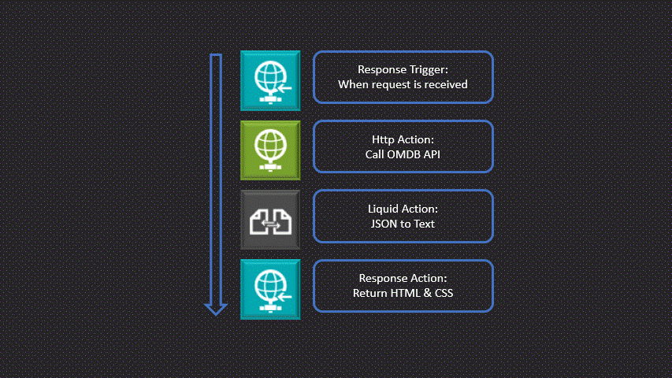

## Background
Logic Apps is great tool for integrating business processes and can be used for multiple different use cases, however building a web pages is not one of them! Let's change that and build simple web app with [Logic Apps (Standard)](https://learn.microsoft.com/en-us/azure/logic-apps/logic-apps-overview).

Before we head into Logic App development I think it is important to understand the fundamentals of web servers, server side rendering and a little about response times! Because we need this to get fully functional web app.

### Web Server 💻
A simple way to explain a web server is a host that serves files to clients and that the communication between the client and server is done through the [HTTP protocol](https://developer.mozilla.org/en-US/docs/Glossary/HTTP).
The client makes a request to web server, the web server can either response with the file or if something went wrong or an error occurred return a error response. [📖](https://developer.mozilla.org/en-US/docs/Learn/Common_questions/Web_mechanics/What_is_a_web_server)
This simple way of hosting webpages is normally referred to what's called a static site. 


### Server Side Rendering
SSR often refers to when a webpage is generated each time a client requests it. In other words, a page returned to the client upon request is a server-side rendered webpage. Compared to static site where pages are pre-generated. [📖](https://dev.to/ebereplenty/server-side-rendering-ssr-vs-static-site-generation-ssg-214k)


### Response times 
When building web apps or anything user related, the less time a user waits the better it is. Response time is a measurement on how long it takes for the client to receive the requested content from the server. Response times that lie around 200ms, is a good reference point to have. [📖](https://developer.mozilla.org/en-US/docs/Web/Performance/How_long_is_too_long)

There is a lot more to be said about these topics, however, I think a general understanding about the concepts will be enuf to continue.

## Turing Logic App into a web app 🌐
As mentioned earlier, Logic Apps does not provide these features out of the box, but we can build it!⚒️

**How do we achieve this?**
1) Logic Apps provide built-in HTTP actions to both react on incoming request and return a response back to the client. This means that we somewhat have the basics of a web server. 
2) We also want to present dynamic content on our webpage. For this, we can use [Liquid](https://shopify.github.io/liquid), with [DotLiquid](https://github.com/dotliquid/dotliquid) being a .NET port of the popular open source project Liquid, and it comes as built-in action in Logic Apps. 
3) Logic Apps are perhaps not known for their fast operations, but in this case I believe Stateless workflows could be a good fit. [Stateless workflows](https://learn.microsoft.com/en-us/azure/logic-apps/single-tenant-overview-compare) is a type of Logic Apps workflow with less overhead and some other features, resulting in faster performance and quicker response times.

So we have a way to communicate with clients, present dynamic content and give fast response times, I believe we have the necessary tools to start building our web app!

**Creating a Logic App Web App**

For simplicity sakes we will build a simple web app to search and display movies using the [Open Movie Database API](https://www.omdbapi.com/). There will be two pages, Home and About section.  

Each page will live inside of a workflow. The workflow will start with the Response trigger "When a request is received" and end with an Response action back to the client. The last Response action need to return html code and have the http header ```Content-Type``` set to ```text/html```, otherwise the browser will not interpitate it correctly. 

In between the request and response action is where all the logic will be placed. Here we will call 3-th parties API:s and use Liquid to transform json into html code.


Create base html liquid template: 
```
<!DOCTYPE html>
<html lang="en">
<head>
    <meta charset="UTF-8">
    <meta name="viewport" content="width=device-width, initial-scale=1.0">
    <title>{{content.title}}</title>
    <link href="https://cdn.jsdelivr.net/npm/bootstrap@5.3.2/dist/css/bootstrap.min.css" rel="stylesheet" integrity="sha384-T3c6CoIi6uLrA9TneNEoa7RxnatzjcDSCmG1MXxSR1GAsXEV/Dwwykc2MPK8M2HN" crossorigin="anonymous">
</head>

<body>
<div class="container">
  <nav class="navbar bg-body-tertiary">
  <div class="container-fluid">
    <form class="d-flex" role="search">
      <input class="form-control me-2" type="search" placeholder="Search" aria-label="Search">
      <button class="btn btn-outline-success" type="submit">Search</button>
    </form>
  </div>
</nav>

{{content.body}}
</div>
<script src="https://cdn.jsdelivr.net/npm/bootstrap@5.3.2/dist/js/bootstrap.bundle.min.js" integrity="sha384-C6RzsynM9kWDrMNeT87bh95OGNyZPhcTNXj1NW7RuBCsyN/o0jlpcV8Qyq46cDfL" crossorigin="anonymous"></script>
</body>

</html>
```