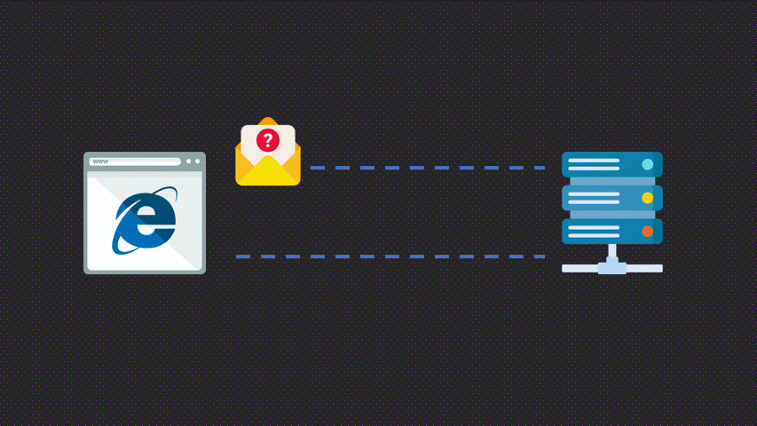
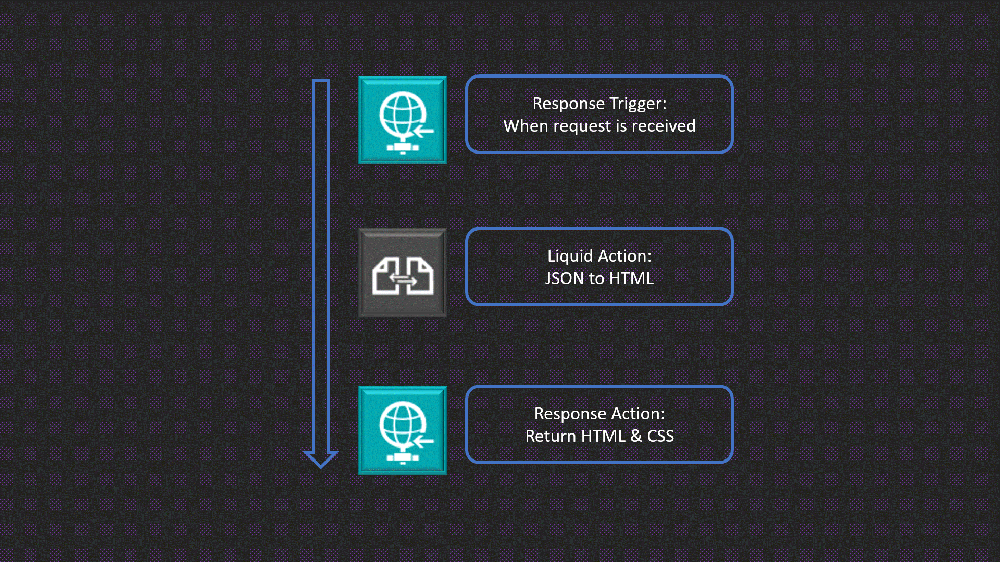

## Background
Logic Apps is great tool for integrating business processes and can be used for multiple different use cases, however building a web pages is not one of them! Let's change that and build simple web app with <a href="https://learn.microsoft.com/en-us/azure/logic-apps/logic-apps-overview" target="_blank" rel="noopener noreferrer">Logic Apps (Standard)</a>.

Before we head into Logic App development I think it is important to understand the fundamentals of web servers, server side rendering and a little about response times! Because we need this to get fully functional web app.

### Web Server 💻
A simple way to explain a web server is a host that serves files to clients and that the communication between the client and server is done through the <a href="https://developer.mozilla.org/en-US/docs/Glossary/HTTP" target="_blank" rel="noopener noreferrer">HTTP protocol</a>.
The client makes a request to web server, the web server can either response with the file or if something went wrong or an error occurred return a error response. <a href="https://developer.mozilla.org/en-US/docs/Learn/Common_questions/Web_mechanics/What_is_a_web_server" target="_blank" rel="noopener noreferrer">📖</a>
This simple way of hosting webpages is normally referred to what's called a static site. 



### Server Side Rendering
SSR often refers to when a webpage is generated each time a client requests it. In other words, a page returned to the client upon request is a server-side rendered webpage. Compared to static site where pages are pre-generated. <a href="https://dev.to/ebereplenty/server-side-rendering-ssr-vs-static-site-generation-ssg-214k" target="_blank" rel="noopener noreferrer">📖</a>


### Response times 
When building web apps or anything user related, the less time a user waits the better it is. Response time is a measurement on how long it takes for the client to receive the requested content from the server. Response times that lie around 200ms, is a good reference point to have. <a href="https://developer.mozilla.org/en-US/docs/Web/Performance/How_long_is_too_long" target="_blank" rel="noopener noreferrer">📖</a>

There is a lot more to be said about these topics, however, I think a general understanding about the concepts will be enuf to continue.

## Turning Logic App into a web app 🌐
As mentioned earlier, Logic Apps does not provide these features out of the box, but we can build it!⚒️

**How do we achieve this?**
1) Logic Apps provide built-in HTTP actions to both react on incoming request and return a response back to the client. This means that we somewhat have the basics of a web server. 
2) We also want to present dynamic content on our webpage. For this, we can use Liquid, with <a href="https://github.com/dotliquid/dotliquid" target="_blank" rel="noopener noreferrer">DotLiquid</a> being a .NET port of the popular open source project Liquid, and it comes as built-in action in Logic Apps. 
3) Logic Apps are perhaps not known for their fast operations, but in this case I believe Stateless workflows could be a good fit. <a href="https://learn.microsoft.com/en-us/azure/logic-apps/single-tenant-overview-compare" target="_blank" rel="noopener noreferrer">Stateless workflows</a> is a type of Logic Apps workflow with less overhead and some other features, resulting in faster performance and quicker response times.

So we have a way to communicate with clients, present dynamic content and give fast response times, I believe we have the necessary tools to start building our web app!

**Creating a Logic App web app**

For the sake of simplicity, we will build a simple web app to search and display movies using the Open Movie Database API. There will be two pages, Home and Search.  

Each page will live inside of a workflow. The workflow will start with the Response trigger "When a request is received" and end with an Response action back to the client. The last Response action need to return html code and have the http header ```Content-Type``` set to ```text/html```, otherwise the browser will not understand it correctly. In between the request and response action is where API calls and etc can be placed. 

Create base html liquid template: 
```
<!DOCTYPE html>
<html lang="en">
<head>
    <meta charset="UTF-8">
    <meta name="viewport" content="width=device-width, initial-scale=1.0">
</head>
<body>
<div class="container">
  <nav>
    <form class="d-flex" role="search" action="{{content.postUrl}}" method="post">
      <input type="search" placeholder="Search" name="search" minlength="2">
      <button type="submit">Search</button>
    </form>
  </nav>
  {{content.body}}
</div>
</body>
</html>
<!-- This is the raw HTML liquid template, without styling. -->
```
Take note on the `content.postUrl` that will be the url of the workflow that calls the omdb API, and the `content.body` is where we will display the result of the omdb API. 

Let's create a liquid template for the movie search results: 
```

<div>
  
  <div class="card">
    
    <div class="card-body">
      <h5>{{item.Title}}</h5>
      <ul>
        <li>Year: {{item.Year}}</li>
        <li>Type: {{item.Type}}</li>
        <li>IMDB: #{{item.imdbID}}</li>
        <!-- omdb API has more properties that can be used, but for simplicity this will work-->
      </ul>
    </div>
  </div>
  
</div>

<!-- This is the raw HTML liquid template, without styling. -->
```

We can now create our two workflows, one for our landing page and another when a user searches on a movie. For debugging purpose it is easier to start with the Stateful and once your done debugging, switch over to Stateless for that optimized low latency performance. 

The home/landing workflow will have the following actions: 

In this example I have not included fetching movie news and etc, this is just the most striped down version of the workflow. 

The search workflow will look something similar to this: 

Once the workflow is created, save the url and make sure to update your liquid templates to use the new url in the `content.postUrl`. 


That's it!🎉🙌 

We have now created a Logic App web app. To view the web app locate the trigger url, copy paste that into your web browser. If you add and bit of styling and it can look something similar to this: 
 

The full project, including workflow files and other resources, can be found on my <a href="https://github.com/antonidag/logic-app-web-app" target="_blank" rel="noopener noreferrer">GitHub</a>! 


## Reflections
Running Logic Apps as a web app had its challenges. Logic Apps are built for orchestrating large enterprise integration scenarios. Making Logic Apps work as a potential use case for web apps, with its hard requirements such as presenting dynamic content, fast response times, and so on, required a thoughtful approach. But it was really fun to see that it works as well as it does!

As for the developer experience, I think if you know your way around HTML and CSS, you can produce results quite rapidly. I began working with the Stateless mode, but it made development painful, so I switched to Stateful mode. The productivity went up, and it felt more like a natural way of working, mostly due to debugging. Developing the actual web app was a great experience once the trial and error period was over. Why? Because of the Logic Apps Run History; you can easily go back and see the request, payloads, headers, and other important properties that you need when you are building a web app.


A core part of transforming Logic App into a web app is the use of a template language such as **Liquid**. It made presenting dynamic content flexible, robust, and had great performance. <a href="https://developer.mozilla.org/en-US/docs/Web/XSLT" target="_blank" rel="noopener noreferrer">XSLT</a> would probably be a good substitute; however, I did not try this in my project.

When it comes to performance, I think there is a lot more that can be done. I mostly ran this project locally on my computer, so it's hard to make any real-world statements about response times and so on. However, what I can say is that you need to balance the number of actions and optimize where you can; otherwise, you will end up with a slow web app. For example, when I introduced Bootstrap with CDN loading for styling, the page loaded noticeably slower. This is somewhat expected since all the styling components are loaded **after** the page is sent to the client. But even with this less optimized implementation, my experience was overall good, perhaps not the greatest but definitely good.


One of the biggest hassles with running Logic Apps as web apps is the routing. By default, all workflows have a `sig` value at the end of the URL, which makes things a bit tricky. The `sig` URL query parameter is an authentication mechanism to provide security and to only allow specific clients to make requests to the workflow. As good as this feature is, we can't predict the value, and we will need to make a post-deployment in order to populate the "paths" to the different workflows. 

Microsoft recommends to have no more than 10-15 workflows per Logic App resource <a href="https://learn.microsoft.com/en-US/azure/logic-apps/create-single-tenant-workflows-azure-portal#best-practices-and-recommendations" target="_blank" rel="noopener noreferrer">📖</a>. This is just a recommendation but an indicator that large scale web apps with hundreds of different pages is perhaps not what the Logic App is cut out for! 

I do see a space for running Logic Apps as a web app. One of the biggest arguments of using Logic Apps is all the built-in connectors that come out of the box. Creating simple request forms, triggering Logic Apps workflows, or an admin interface are just some of the use cases where Logic Apps can be useful 💡. Another point to be made is that we as Integration Developers can work with the tools we know and like. 


Could Logic Apps and web development be the next big thing in the integration space? 🤔 Drop your insights, questions, or ideas below. 