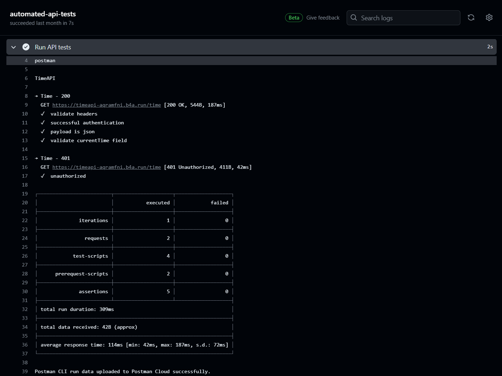

## Background 
Testing software is an important part of its lifecycle and a big part of its success. There is lot different frameworks and method out there. Finding the right tool for the project could sometime be challenging! [Postman](https://www.postman.com/) is popular API platform for building and using APIs, and widely used among developers, architects and technical functions! 

Integrating testing in the CI pipeline can improve the overall quality and productivity. Therefor, in this blog post we will explore how Postman can be used to automate API testing using Github Actions. 

## What is Postman?
As mention before Postman is a popular platform to build and using API:. Postman is packed with a lot of features such as workspaces where you share and build API artifacts. It also comes with the availability to perform load testing and test individual API:s. For more information more about Postman and its feature read more at their [website](https://www.postman.com/product/what-is-postman/)

## Integration Testing
When it comes to testing software there are many different approaches unit, functional, integration and end-to-end testing to mention a few. Some are more fitted for some type of testing and other for another method. Integration testing verifies that the components or modules interacts as intended. Typically integration tests could be verifying an: 
- External API 
- Database Integration
- or File system Integration

[book](https://www.techtarget.com/searchsoftwarequality/definition/integration-testing)

## Creating API tests in Postman
We are going to work with a simple Time API that I have created for this blog. The operation returns the current time in a json payload. You need to authenticate with Basic Auth to authenticate forwards the API. Here is a raw HTTP response to give you an idea of what we are dealing with: 
```
HTTP/1.1 200 OK
Content-Type: application/json; charset=utf-8
Content-Length: 42
Connection: keep-alive
Date: Mon, 18 Mar 2024 16:07:12 GMT
x-powered-by: Express
access-control-allow-methods: GET
x-content-type-options: nosniff
cache-control: no-cache
etag: W/"2a-123abc"

{
  "currentTime" : "2024-03-18T16:07:12.026Z"
}
```

We will test & validate that the:
- Basic Authentication is working
- Validate the expected HTTP Headers
- Validate json payload


Before we can jump into writing test, we first need work inside of Postman. 
Start by creating a new Collection and name it appropriate to the API you are testing, in my case "Time API". Collections is a how API:s can be organized in Postman.  
There is several ways to import collections and API:s, in my case I think it easiest to create the HTTP request manually. Depending on your API there could other types on parameters, headers and authentication required, Postman allows an simple interface to configure this. 

To create test for an API we need to navigate to the "Test" menu. Test are written in JavaScript, the Postman JavaScript API documentation can be found [here](https://learning.postman.com/docs/writing-scripts/script-references/script-reference-overview/).

Let's start by make sure everything is working as it should, by creating this simple test:
```
pm.test("response is ok", function () {
    pm.response.to.have.status(200)
})

```
To run the test, we need to right click the collection and enter the "Run collection" menu. Then we can click on run to see the results. 

Once you understand the syntax and its framework writing test in Postman is really easy.

Here is the final JavaScript code: 
```
//-----Validate Authentication
pm.test("successful authentication", function () {
    pm.expect(pm.response).to.have.status(200); // 200 indicates successful authentication
});

//-----Validate HTTP Headers
pm.test("validate headers", function () {
    pm.response.to.have.header('Content-Type', 'application/json; charset=utf-8'); // Check Content-Type header value
    pm.response.to.have.header('Access-Control-Allow-Methods', 'GET'); // Check Access-Control-Allow-Methods header value
    pm.response.to.have.header('X-Content-Type-Options', 'nosniff'); // Check X-Content-Type-Options header value
    pm.response.to.have.header('Cache-Control', 'no-cache'); // Check Cache-Control header value
});

//-----Validate payload
pm.test("payload is json", function () {
    pm.response.to.have.jsonBody(); // Check body to be json
})

pm.test("validate currentTime field", function () {
    // Parse the response body as JSON
    var responseBody = pm.response.json();

    // Check if the currentTime field exists
    pm.expect(responseBody).to.have.property('currentTime');

    // Check if the currentTime field is a valid ISO 8601 date
    pm.expect(responseBody.currentTime).to.match(/^\d{4}-\d{2}-\d{2}T\d{2}:\d{2}:\d{2}.\d{3}Z$/);
});
```

There is a great guide on this topic at Postman documentation, if you want to know more about see [here]().

## Automate Postman Test with Github Actions
Before diving into the setup process, there are a few prerequisites to fix:
- __Generate Postman API Key__
- __Set up a GitHub Project:__ Create a project in GitHub and set up an Environment within your project.
- __Add GitHub Secrets:__ Store credentials securely as GitHub secrets to ensure they are not exposed in your repository.

```
name: Automated API tests using Postman CLI

on: push

jobs:
  automated-api-tests:
    runs-on: ubuntu-latest
    steps:
      - uses: actions/checkout@v3
      - name: Install Postman CLI
        run: |
          curl -o- "https://dl-cli.pstmn.io/install/linux64.sh" | sh
      - name: Login to Postman CLI
        run: postman login --with-api-key ${{ secrets.POSTMAN_API_KEY }}
      - name: Run API tests
        run: |
          postman collection run "27855227-be5be94b-8361-4efc-afd2-49762436fcef"
```

When the workflow is triggered it will generate an run like this:

Here you can see the summery of the all the tests and valvule information such as execution time, how many assertions and etc.

## Reflection