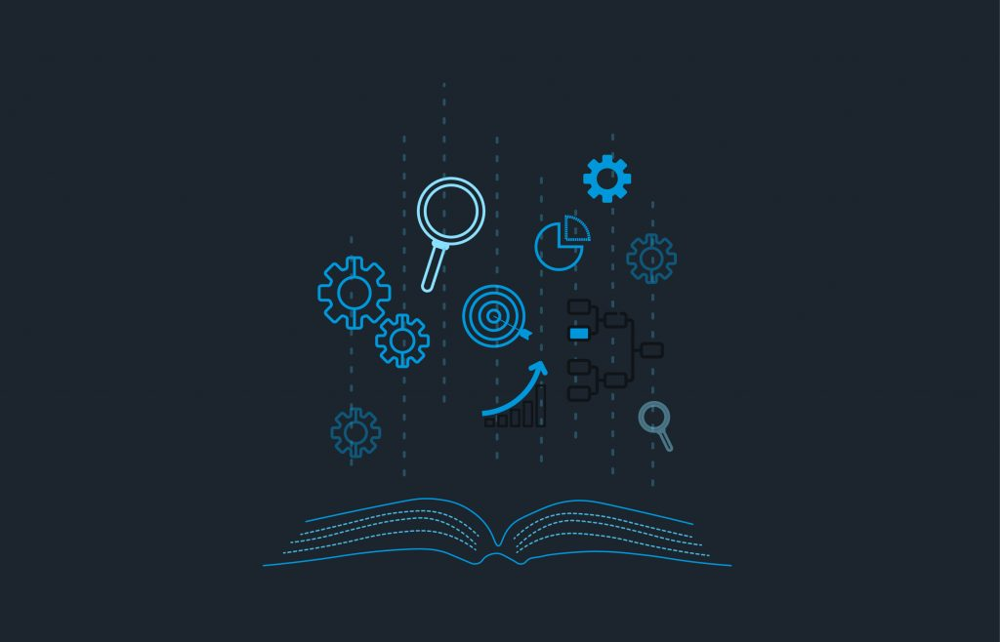

# A Paradigm Shift in Workflow Development: Unleashing the Power of Azure Logic Apps

kom på ett snitsit namn med förkortningarna 

## Introduction

In the ever-evolving landscape of application integration, developers are constantly seeking innovative approaches to streamline workflows and enhance system interoperability. Azure Logic Apps, a powerful cloud-based service, has emerged as a key player in this domain, offering a flexible and scalable solution for designing workflows. In this blog post, we'll explore a novel perspective on workflow development, leveraging a methodology that combines elements of ETL and microservices. By dividing workflows into distinct areas of responsibility, developers can create more modular, reusable, and maintainable solutions.

## Current Workflow Landscape:
Dive into the current, somewhat lackluster, methods developers employ in Azure Logic Apps. Paint a vivid picture of the existing routine and its underwhelming aspects.

## Challenges and Issues:
Unveil the pain points and roadblocks developers encounter in the existing workflow landscape. Highlight the frustrations and limitations, making it clear that change is overdue.
## Why Change is Needed:
Ignite a sense of urgency by vividly explaining why the current state is no longer acceptable. Describe the missed opportunities and the potential for a brighter, more efficient future.
## Proposed Methodology:
Introduce the groundbreaking methodology that's about to shake things up. Tease the ETL-microservices fusion as the secret sauce that will revolutionize Azure Logic Apps workflow development.

Introduce the concept of ETL.

Introduce service oriented, and how that can be applied with logic apps.

Lay the base ground

key features and how we can use them
## Dividing Responsibilities

Consider the scenario of implementing a new integration between System X and System Y, where data must be fetched from System X, undergo transformation, and then be loaded or pushed to System Y. The key to efficient workflow development lies in breaking down this process into separate areas of responsibility.

### 1. Orchestration Workflow

Begin by creating a central orchestration workflow responsible for defining the overall flow of the integration process. This workflow acts as the conductor, determining the sequence of steps – such as fetching data, transformation, and data delivery. By isolating the orchestration logic, developers gain greater control and flexibility over the entire workflow.

### 2. Data Workflow

Next, introduce a dedicated workflow for fetching data from the source system (System X). The focus of this workflow is solely on retrieving data and returning it, without altering the payload. The method of data delivery, whether through HTTP response, service bus, or blob endpoint, is left to the orchestration workflow to handle. This separation of concerns enhances reusability and allows for easy adaptation to changes in data sources.

### 3. Transformation Workflow

For data transformation, create a specialized workflow focused solely on this critical task. The transformation workflow takes the raw data from the get data workflow and processes it according to predefined rules. By isolating the transformation logic, developers can easily modify or enhance this step without affecting other parts of the integration process.

### 4. Delivery Workflow

Finally, implement a dedicated workflow for delivering the transformed data to System Y. This workflow ensures a smooth and reliable handoff of data to the destination system. Like the other workflows, its role is narrowly defined, contributing to a modular and easily maintainable architecture.

## Trigger Workflow

Introduce a "trigger" workflow designed to initiate the orchestration workflow. This additional layer of abstraction allows for more fine-grained control over the initiation process, enabling developers to customize triggers and responses based on specific conditions.

## Benefits of the Methodology:
Unleash a torrent of excitement by revealing the incredible advantages of adopting this spicy methodology. It's not just about improvement; it's about a dynamic, reinvigorated workflow that's ready to conquer any challenge.

By adopting this methodology, developers unlock a host of advantages:

- **Reusability:** Each workflow can be reused across different integration scenarios, reducing development time and effort.

- **Flexibility:** Changes in one area of responsibility do not necessitate modifications in others, providing a flexible and adaptable system.

- **Maintainability:** Isolating responsibilities simplifies debugging, maintenance, and updates, ensuring a robust and resilient integration solution.

## Conclusion:
Conclude with a sassy recap of the transformation journey. Remind readers that they're not just adopting a methodology; they're stepping into a new era of workflow development. Encourage them to embrace the heat!
Remember, the key is to engage your readers with vivid language, captivating metaphors, and a touch of drama. This approach will leave them not just informed but excited to revolutionize their workflow development.

In the realm of Azure Logic Apps, embracing a methodology that combines ETL and microservices principles brings a new level of sophistication to workflow development. By dividing responsibilities and creating modular workflows, developers can build agile, scalable, and easily maintainable integration solutions that adapt seamlessly to evolving business requirements.
